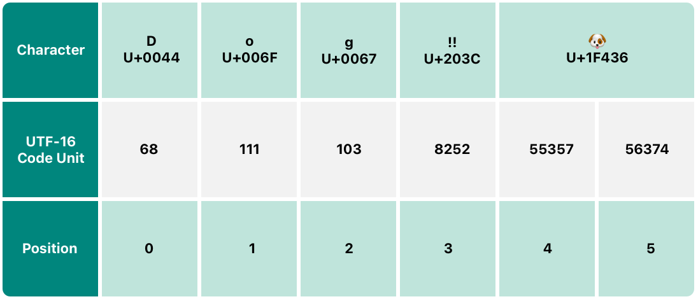

Swift v5.7 | [Swift versions](find-my-swift-version.md) | [Swift.org](https://docs.swift.org).

Taken from the [official Swift documentation](https://docs.swift.org/swift-book/LanguageGuide/TheBasics.html).


👉 You can [view this document in Xcode](https://github.com/MatthewpHarding/SWIFTDOCS-3-strings-and-characters/archive/refs/heads/main.zip) to run and edit each example.
## Run This File In Xcode

**Step 1:** Clone this repo or [download the files](https://github.com/MatthewpHarding/SWIFTDOCS-3-strings-and-characters/archive/refs/heads/main.zip).

**Step 2:** In Xcode, ensure you have selected **Editor/Show Rendered Markup** to view the formatted instructions.

**Step 3:** You can edit the code within Xcode!  🎉

🤩 *..let's live a better life, by learning Swift* 🛠

```Swift
let myLife = [learning, coding, happiness] 
```
### 🧕🏻👨🏿‍💼👩🏼‍💼👩🏻‍💻👨🏼‍💼🧛🏻‍♀️👩🏼‍💻💁🏽‍♂️🕵🏻‍♂️🧝🏼‍♀️🦹🏼‍♀🧕🏾🧟‍♂️
-----------
# *Page 3* → Strings and Characters

A string is a series of characters, such as `"hello, world"` or `"albatross"`. Swift strings are represented by the String type. The contents of a `String` can be accessed in various ways, including as a collection of `Character` values.

Swift’s `String` and `Character` types provide a fast, Unicode-compliant way to work with text in your code. The syntax for string creation and manipulation is lightweight and readable, with a string literal syntax that’s similar to C. String concatenation is as simple as combining two strings with the + operator, and string mutability is managed by choosing between a constant or a variable, just like any other value in Swift. You can also use strings to insert constants, variables, literals, and expressions into longer strings, in a process known as string interpolation. This makes it easy to create custom string values for display, storage, and printing.

Despite this simplicity of syntax, Swift’s `String` type is a fast, modern string implementation. Every string is composed of encoding-independent Unicode characters, and provides support for accessing those characters in various Unicode representations.

>Note
>
>→ Swift’s `String` type is bridged with Foundation’s `NSString` class. Foundation also extends String to expose methods defined by `NSString`. This means, if you import Foundation, you can access those `NSString` methods on `String` without casting.
>
>For more information about using `String` with Foundation and Cocoa, see Bridging Between `String` and `NSString`.

## String Literals

You can include predefined `String` values within your code as string literals. A string literal is a sequence of characters surrounded by double quotation marks (`"`).

Use a string literal as an initial value for a constant or variable:
let someString = "Some string literal value"
Note that Swift infers a type of `String` for the `someString` constant because it’s initialized with a string literal value.

### Multiline String Literals

If you need a string that spans several lines, use a multiline string literal — a sequence of characters surrounded by three double quotation marks:

```Swift
let quotation = """
The White Rabbit put on his spectacles.  "Where shall I begin,
please your Majesty?" he asked.

"Begin at the beginning," the King said gravely, "and go on
till you come to the end; then stop."
"""
```
A multiline string literal includes all of the lines between its opening and closing quotation marks. The string begins on the first line after the opening quotation marks (`"""`) and ends on the line before the closing quotation marks, which means that neither of the strings below start or end with a line break:

```Swift
let singleLineString = "These are the same."
let multilineString = """
These are the same.
"""
```
When your source code includes a line break inside of a multiline string literal, that line break also appears in the string’s value. If you want to use line breaks to make your source code easier to read, but you don’t want the line breaks to be part of the string’s value, write a backslash (`\`) at the end of those lines:

```Swift
let softWrappedQuotation = """
The White Rabbit put on his spectacles.  "Where shall I begin, \
please your Majesty?" he asked.

"Begin at the beginning," the King said gravely, "and go on \
till you come to the end; then stop."
"""
```
To make a multiline string literal that begins or ends with a line feed, write a blank line as the first or last line. For example:

```Swift
let lineBreaks = """
This string starts with a line break.
It also ends with a line break.

"""
```
A multiline string can be indented to match the surrounding code. The whitespace before the closing quotation marks (`"""`) tells Swift what whitespace to ignore before all of the other lines. However, if you write whitespace at the beginning of a line in addition to what’s before the closing quotation marks, that whitespace is included.


In the example above, even though the entire multiline string literal is indented, the first and last lines in the string don’t begin with any whitespace. The middle line has more indentation than the closing quotation marks, so it starts with that extra four-space indentation.

### Special Characters in String Literals

String literals can include the following special characters:

* The escaped special characters `\0` (null character), `\\` (backslash), `\t` (horizontal tab), `\n` (line feed), `\r` (carriage return), `\"` (double quotation mark) and `\'` (single quotation mark)

* An arbitrary Unicode scalar value, written as `\u{n}`, where n is a 1–8 digit hexadecimal number (Unicode is discussed in Unicode below)

The code below shows four examples of these special characters. The `wiseWords` constant contains two escaped double quotation marks. The `dollarSign`, `blackHeart`, and `sparklingHeart` constants demonstrate the Unicode scalar format:

```Swift
let wiseWords = "\"Imagination is more important than knowledge\" - Einstein"
// "Imagination is more important than knowledge" - Einstein
let dollarSign = "\u{24}"        // $,  Unicode scalar U+0024
let blackHeart = "\u{2665}"      // ♥,  Unicode scalar U+2665
let sparklingHeart = "\u{1F496}" // 💖, Unicode scalar U+1F496
```
Because multiline string literals use three double quotation marks instead of just one, you can include a double quotation mark (`"`) inside of a multiline string literal without escaping it. To include the text `"""` in a multiline string, escape at least one of the quotation marks. For example:

```Swift
let threeDoubleQuotationMarks = """
//Escaping the first quotation mark \"""
Escaping all three quotation marks \"\"\"
"""
```

### Extended String Delimiters

You can place a string literal within extended delimiters to include special characters in a string without invoking their effect. You place your string within quotation marks (`"`) and surround that with number signs (`#`). For example, printing the string literal `#"Line 1\nLine 2"#` prints the line feed escape sequence (`\n`) rather than printing the string across two lines.

If you need the special effects of a character in a string literal, match the number of number signs within the string following the escape character (`\`). For example, if your string is `#"Line 1\nLine 2"#` and you want to break the line, you can use `#"Line 1\#nLine 2"#` instead. Similarly, `###"Line1\###nLine2"###` also breaks the line.

String literals created using extended delimiters can also be multiline string literals. You can use extended delimiters to include the text `"""` in a multiline string, overriding the default behavior that ends the literal. For example:

```Swift
let threeMoreDoubleQuotationMarks = #"""
Here are three more double quotes: """
"""#
```

## Initializing an Empty String

To create an empty `String` value as the starting point for building a longer string, either assign an empty string literal to a variable, or initialize a new `String` instance with initializer syntax:

```Swift
var emptyString = ""               // empty string literal
var anotherEmptyString = String()  // initializer syntax
// these two strings are both empty, and are equivalent to each other
```

Find out whether a `String` value is empty by checking its Boolean `isEmpty` property:

```Swift
if emptyString.isEmpty {
    print("Nothing to see here")
}
// Prints "Nothing to see here"
```

## String Mutability

You indicate whether a particular String can be modified (or mutated) by assigning it to a variable (in which case it can be modified), or to a constant (in which case it can’t be modified):

```Swift
var variableString = "Horse"
variableString += " and carriage"
// variableString is now "Horse and carriage"

let constantString = "Highlander"
constantString += " and another Highlander"
// this reports a compile-time error - a constant string cannot be modified
```

>Note
>
>→ This approach is different from string mutation in Objective-C and Cocoa, where you choose between two classes (`NSString` and `NSMutableString`) to indicate whether a string can be mutated.

## Strings Are Value Types

Swift’s `String` type is a value type. If you create a new `String` value, that `String` value is copied when it’s passed to a function or method, or when it’s assigned to a constant or variable. In each case, a new copy of the existing `String` value is created, and the new copy is passed or assigned, not the original version. Value types are described in Structures and Enumerations Are Value Types.

Swift’s copy-by-default `String` behavior ensures that when a function or method passes you a `String` value, it’s clear that you own that exact `String` value, regardless of where it came from. You can be confident that the string you are passed won’t be modified unless you modify it yourself.

Behind the scenes, Swift’s compiler optimizes string usage so that actual copying takes place only when absolutely necessary. This means you always get great performance when working with strings as value types.

## Working with Characters

You can access the individual `Character` values for a `String` by iterating over the `string` with a `for-in` loop:

```Swift
for character in "Dog!🐶" {
    print(character)
}
// D
// o
// g
// !
// 🐶
```
The `for-in` loop is described in For-In Loops.

Alternatively, you can create a stand-alone `Character` constant or variable from a single-character string literal by providing a `Character` type annotation:

```Swift
let exclamationMark: Character = "!"
```

`String` values can be constructed by passing an array of `Character` values as an argument to its initializer:

```Swift
let catCharacters: [Character] = ["C", "a", "t", "!", "🐱"]
let catString = String(catCharacters)
print(catString)
// Prints "Cat!🐱"
```

## Concatenating Strings and Characters

`String` values can be added together (or concatenated) with the addition operator (`+`) to create a new `String` value:

```Swift
let string1 = "hello"
let string2 = " there"
var welcome = string1 + string2
// welcome now equals "hello there"
```

You can also append a `String` value to an existing `String` variable with the addition assignment operator (`+=`):

```Swift
var instruction = "look over"
instruction += string2
// instruction now equals "look over there"
```

You can append a `Character` value to a `String` variable with the `String` type’s `append()` method:

```Swift
welcome.append(exclamationMark)
// welcome now equals "hello there!"
```

>Note
>
>→ You can’t append a `String` or `Character` to an existing `Character` variable, because a `Character` value must contain a single character only.

If you’re using multiline string literals to build up the lines of a longer string, you want every line in the string to end with a line break, including the last line. For example:

```Swift
let badStart = """
one
two
"""
let end = """
three
"""
print(badStart + end)
// Prints two lines:
// one
// twothree

let goodStart = """
one
two

"""
print(goodStart + end)
// Prints three lines:
// one
// two
// three
```

In the code above, concatenating `badStart` with end produces a two-line string, which isn’t the desired result. Because the last line of `badStart` doesn’t end with a line break, that line gets combined with the first line of end. In contrast, both lines of `goodStart` end with a line break, so when it’s combined with end the result has three lines, as expected.

## String Interpolation

`String` interpolation is a way to construct a new `String` value from a mix of constants, variables, literals, and expressions by including their values inside a string literal. You can use string interpolation in both single-line and multiline string literals. Each item that you insert into the string literal is wrapped in a pair of parentheses, prefixed by a backslash (`\`):

```Swift
let multiplier = 3
let message = "\(multiplier) times 2.5 is \(Double(multiplier) * 2.5)"
// message is "3 times 2.5 is 7.5"
```

In the example above, the value of `multiplier` is inserted into a string literal as `\(multiplier)`. This placeholder is replaced with the actual value of `multiplier` when the string interpolation is evaluated to create an actual string.

The value of `multiplier` is also part of a larger expression later in the string. This expression calculates the value of `Double(multiplier) * 2.5` and inserts the result (`7.5`) into the string. In this case, the expression is written as `\(Double(multiplier) * 2.5)` when it’s included inside the string literal.

You can use extended string delimiters to create strings containing characters that would otherwise be treated as a string interpolation. For example:

```Swift
print(#"Write an interpolated string in Swift using \(multiplier)."#)
// Prints "Write an interpolated string in Swift using \(multiplier)."
```

To use string interpolation inside a string that uses extended delimiters, match the number of number signs after the backslash to the number of number signs at the beginning and end of the string. For example:

```Swift
print(#"6 times 7 is \#(6 * 7)."#)
// Prints "6 times 7 is 42."
```

>Note
>
>→ The expressions you write inside parentheses within an interpolated string can’t contain an unescaped backslash (`\`), a carriage return, or a line feed. However, they can contain other string literals.

## Unicode

Unicode is an international standard for encoding, representing, and processing text in different writing systems. It enables you to represent almost any character from any language in a standardized form, and to read and write those characters to and from an external source such as a text file or web page. Swift’s String and Character types are fully Unicode-compliant, as described in this section.

### Unicode Scalar Values

Behind the scenes, Swift’s native `String` type is built from Unicode scalar values. A Unicode scalar value is a unique 21-bit number for a character or modifier, such as `U+0061` for `LATIN SMALL LETTER A` (`"a"`), or `U+1F425` for `FRONT-FACING BABY CHICK` (`"🐥"`).

Note that not all 21-bit Unicode scalar values are assigned to a character—some scalars are reserved for future assignment or for use in `UTF-16` encoding. Scalar values that have been assigned to a character typically also have a name, such as `LATIN SMALL LETTER A` and `FRONT-FACING BABY CHICK` in the examples above.

### Extended Grapheme Clusters

Every instance of Swift’s Character type represents a single extended grapheme cluster. An extended grapheme cluster is a sequence of one or more Unicode scalars that (when combined) produce a single human-readable character.

Here’s an example. The letter `é` can be represented as the single Unicode scalar `é` (`LATIN SMALL LETTER E WITH ACUTE`, or `U+00E9`). However, the same letter can also be represented as a pair of scalars — a standard letter `e` (`LATIN SMALL LETTER E`, or `U+0065`), followed by the `COMBINING ACUTE ACCENT` scalar (`U+0301`). The `COMBINING ACUTE ACCENT` scalar is graphically applied to the scalar that precedes it, turning an `e` into an `é` when it’s rendered by a Unicode-aware text-rendering system.

In both cases, the letter `é` is represented as a single Swift `Character` value that represents an extended grapheme cluster. In the first case, the cluster contains a single scalar; in the second case, it’s a cluster of two scalars:

```Swift
let eAcute: Character = "\u{E9}"                         // é
let combinedEAcute: Character = "\u{65}\u{301}"          // e followed by
// eAcute is é, combinedEAcute is é
```

Extended grapheme clusters are a flexible way to represent many complex script characters as a single `Character` value. For example, Hangul syllables from the Korean alphabet can be represented as either a precomposed or decomposed sequence. Both of these representations qualify as a single Character value in Swift:

```Swift
let precomposed: Character = "\u{D55C}"                  // 한
let decomposed: Character = "\u{1112}\u{1161}\u{11AB}"   // ᄒ, ᅡ, ᆫ
// precomposed is 한, decomposed is 한
```

Extended grapheme clusters enable scalars for enclosing marks (such as `COMBINING ENCLOSING CIRCLE`, or `U+20DD`) to enclose other Unicode scalars as part of a single Character value:

```Swift
let enclosedEAcute: Character = "\u{E9}\u{20DD}"
// enclosedEAcute is é⃝
```

Unicode scalars for regional indicator symbols can be combined in pairs to make a single `Character` value, such as this combination of `REGIONAL INDICATOR SYMBOL LETTER U` (`U+1F1FA`) and `REGIONAL INDICATOR SYMBOL LETTER S` (`U+1F1F8`):

```Swift
let regionalIndicatorForUS: Character = "\u{1F1FA}\u{1F1F8}"
// regionalIndicatorForUS is 🇺🇸
```

## Counting Characters

To retrieve a count of the `Character` values in a string, use the `count` property of the string:

```Swift
let unusualMenagerie = "Koala 🐨, Snail 🐌, Penguin 🐧, Dromedary 🐪"
print("unusualMenagerie has \(unusualMenagerie.count) characters")
// Prints "unusualMenagerie has 40 characters"
```

Note that Swift’s use of extended grapheme clusters for `Character` values means that string concatenation and modification may not always affect a string’s character count.

For example, if you initialize a new string with the four-character word cafe, and then append a `COMBINING ACUTE ACCENT` (`U+0301`) to the end of the string, the resulting string will still have a character count of 4, with a fourth character of `é`, not `e`:

```Swift
var word = "cafe"
print("the number of characters in \(word) is \(word.count)")
// Prints "the number of characters in cafe is 4"

word += "\u{301}"    // COMBINING ACUTE ACCENT, U+0301

print("the number of characters in \(word) is \(word.count)")
// Prints "the number of characters in café is 4"
```

>Note
>
>→ Extended grapheme clusters can be composed of multiple Unicode scalars. This means that different characters—and different representations of the same character—can require different amounts of memory to store. Because of this, characters in Swift don’t each take up the same amount of memory within a string’s representation. As a result, the number of characters in a string can’t be calculated without iterating through the string to determine its extended grapheme cluster boundaries. If you are working with particularly long string values, be aware that the count property must iterate over the Unicode scalars in the entire string in order to determine the characters for that string.

>The count of the characters returned by the `count` property isn’t always the same as the `length` property of an `NSString` that contains the same characters. The length of an `NSString` is based on the number of 16-bit code units within the string’s UTF-16 representation and not the number of Unicode extended grapheme clusters within the string.

## Accessing and Modifying a String

You access and modify a string through its methods and properties, or by using subscript syntax.

### String Indices

Each `String` value has an associated index type, `String.Index`, which corresponds to the position of each `Character` in the string.

As mentioned above, different characters can require different amounts of memory to store, so in order to determine which `Character` is at a particular position, you must iterate over each Unicode scalar from the start or end of that `String`. For this reason, Swift strings can’t be indexed by integer values.

Use the `startIndex` property to access the position of the first `Character` of a `String`. The `endIndex` property is the position after the last character in a `String`. As a result, the `endIndex` property isn’t a valid argument to a string’s subscript. If a `String` is empty, `startIndex` and `endIndex` are equal.

You access the indices before and after a given index using the `index(before:)` and `index(after:)` methods of `String`. To access an index farther away from the given index, you can use the `index(_:offsetBy:)` method instead of calling one of these methods multiple times.

You can use subscript syntax to access the `Character` at a particular String index.

```Swift
var greeting = "Guten Tag!"
greeting[greeting.startIndex]
// G
greeting[greeting.index(before: greeting.endIndex)]
// !
greeting[greeting.index(after: greeting.startIndex)]
// u
var index = greeting.index(greeting.startIndex, offsetBy: 7)
greeting[index]
// a
```

Attempting to access an index outside of a string’s range or a `Character` at an index outside of a string’s range will trigger a runtime error.

```Swift
greeting[greeting.endIndex] // Error
greeting.index(after: greeting.endIndex) // Error
```

Use the indices property to access all of the indices of individual characters in a string.

```Swift
for index in greeting.indices {
    print("\(greeting[index]) ", terminator: "")
}
// Prints "G u t e n   T a g ! "
```

>Note
>
>→ You can use the `startIndex` and `endIndex` properties and the `index(before:)`, `index(after:)`, and `index(_:offsetBy:)` methods on any type that conforms to the `Collection` protocol. This includes `String`, as shown here, as well as collection types such as `Array`, `Dictionary`, and `Set`.

### Inserting and Removing

To insert a single character into a string at a specified index, use the `insert(_:at:)` method, and to insert the contents of another string at a specified index, use the `insert(contentsOf:at:)` method.

```Swift
welcome = "hello"
welcome.insert("!", at: welcome.endIndex)
// welcome now equals "hello!"

welcome.insert(contentsOf: " there", at: welcome.index(before: welcome.endIndex))
// welcome now equals "hello there!"
```

To remove a single character from a string at a specified index, use the `remove(at:)` method, and to remove a substring at a specified range, use the `removeSubrange(_:)` method:

```Swift
welcome.remove(at: welcome.index(before: welcome.endIndex))
// welcome now equals "hello there"

let range = welcome.index(welcome.endIndex, offsetBy: -6)..<welcome.endIndex
welcome.removeSubrange(range)
// welcome now equals "hello"
```

>Note
>
>→ You can use the `insert(_:at:)`, `insert(contentsOf:at:)`, `remove(at:)`, and `removeSubrange(_:)` methods on any type that conforms to the `RangeReplaceableCollection` protocol. This includes `String`, as shown here, as well as collection types such as `Array`, `Dictionary`, and `Set`.

## Substrings

When you get a substring from a string—for example, using a subscript or a method like `prefix(_:)`—the result is an instance of `Substring`, not another string. Substrings in Swift have most of the same methods as strings, which means you can work with substrings the same way you work with strings. However, unlike strings, you use substrings for only a short amount of time while performing actions on a string. When you’re ready to store the result for a longer time, you convert the substring to an instance of `String`. For example:

```Swift
greeting = "Hello, world!"
index = greeting.firstIndex(of: ",") ?? greeting.endIndex
let beginning = greeting[..<index]
// beginning is "Hello"

// Convert the result to a String for long-term storage.
let newString = String(beginning)
```

Like strings, each substring has a region of memory where the characters that make up the substring are stored. The difference between strings and substrings is that, as a performance optimization, a substring can reuse part of the memory that’s used to store the original string, or part of the memory that’s used to store another substring. (Strings have a similar optimization, but if two strings share memory, they’re equal.) This performance optimization means you don’t have to pay the performance cost of copying memory until you modify either the string or substring. As mentioned above, substrings aren’t suitable for long-term storage—because they reuse the storage of the original string, the entire original string must be kept in memory as long as any of its substrings are being used.

In the example above, `greeting` is a string, which means it has a region of memory where the characters that make up the string are stored. Because beginning is a substring of `greeting`, it reuses the memory that `greeting` uses. In contrast, `newString` is a string—when it’s created from the substring, it has its own storage. The figure below shows these relationships:


>Note
>
>→ Both `String` and `Substring` conform to the `StringProtocol` protocol, which means it’s often convenient for string-manipulation functions to accept a `StringProtocol` value. You can call such functions with either a `String` or `Substring` value.

## Comparing Strings

Swift provides three ways to compare textual values: string and character equality, prefix equality, and suffix equality.

### String and Character Equality

String and character equality is checked with the “equal to” operator (`==`) and the “not equal to” operator (`!=`), as described in Comparison Operators:


```Swift
let originalQuotation = "We're a lot alike, you and I."
let sameQuotation = "We're a lot alike, you and I."
if originalQuotation == sameQuotation {
    print("These two strings are considered equal")
}
// Prints "These two strings are considered equal"
```

Two `String` values (or two `Character` values) are considered equal if their extended grapheme clusters are canonically equivalent. Extended grapheme clusters are canonically equivalent if they have the same linguistic meaning and appearance, even if they’re composed from different Unicode scalars behind the scenes.

For example, `LATIN SMALL LETTER E WITH ACUTE` (`U+00E9`) is canonically equivalent to `LATIN SMALL LETTER E` (`U+0065`) followed by `COMBINING ACUTE ACCENT` (`U+0301`). Both of these extended grapheme clusters are valid ways to represent the character `é`, and so they’re considered to be canonically equivalent:

```Swift
// "Voulez-vous un café?" using LATIN SMALL LETTER E WITH ACUTE
let eAcuteQuestion = "Voulez-vous un caf\u{E9}?"

// "Voulez-vous un café?" using LATIN SMALL LETTER E and COMBINING ACUTE ACCENT
let combinedEAcuteQuestion = "Voulez-vous un caf\u{65}\u{301}?"

if eAcuteQuestion == combinedEAcuteQuestion {
    print("These two strings are considered equal")
}
// Prints "These two strings are considered equal"
```

Conversely, `LATIN CAPITAL LETTER A` (`U+0041`, or `"A"`), as used in English, is not equivalent to `CYRILLIC CAPITAL LETTER A` (`U+0410`, or `"А"`), as used in Russian. The characters are visually similar, but don’t have the same linguistic meaning:

```Swift
let latinCapitalLetterA: Character = "\u{41}"

let cyrillicCapitalLetterA: Character = "\u{0410}"

if latinCapitalLetterA != cyrillicCapitalLetterA {
    print("These two characters aren't equivalent.")
}
// Prints "These two characters aren't equivalent."
```

>Note
>
>→ String and character comparisons in Swift aren’t locale-sensitive.

### Prefix and Suffix Equality

To check whether a string has a particular string prefix or suffix, call the string’s `hasPrefix(_:)` and `hasSuffix(_:)` methods, both of which take a single argument of type `String` and return a Boolean value.

The examples below consider an array of strings representing the scene locations from the first two acts of Shakespeare’s Romeo and Juliet:

```Swift
let romeoAndJuliet = [
    "Act 1 Scene 1: Verona, A public place",
    "Act 1 Scene 2: Capulet's mansion",
    "Act 1 Scene 3: A room in Capulet's mansion",
    "Act 1 Scene 4: A street outside Capulet's mansion",
    "Act 1 Scene 5: The Great Hall in Capulet's mansion",
    "Act 2 Scene 1: Outside Capulet's mansion",
    "Act 2 Scene 2: Capulet's orchard",
    "Act 2 Scene 3: Outside Friar Lawrence's cell",
    "Act 2 Scene 4: A street in Verona",
    "Act 2 Scene 5: Capulet's mansion",
    "Act 2 Scene 6: Friar Lawrence's cell"
]
```

You can use the `hasPrefix(_:)` method with the `romeoAndJuliet` array to count the number of scenes in Act 1 of the play:

```Swift
var act1SceneCount = 0
for scene in romeoAndJuliet {
    if scene.hasPrefix("Act 1 ") {
        act1SceneCount += 1
    }
}
print("There are \(act1SceneCount) scenes in Act 1")
// Prints "There are 5 scenes in Act 1"
```

Similarly, use the `hasSuffix(_:)` method to count the number of scenes that take place in or around Capulet’s mansion and Friar Lawrence’s cell:

```Swift
var mansionCount = 0
var cellCount = 0
for scene in romeoAndJuliet {
    if scene.hasSuffix("Capulet's mansion") {
        mansionCount += 1
    } else if scene.hasSuffix("Friar Lawrence's cell") {
        cellCount += 1
    }
}
print("\(mansionCount) mansion scenes; \(cellCount) cell scenes")
// Prints "6 mansion scenes; 2 cell scenes"
```

>Note
>
>→ The `hasPrefix(_:)` and `hasSuffix(_:)` methods perform a character-by-character canonical equivalence comparison between the extended grapheme clusters in each string, as described in String and Character Equality.

## Unicode Representations of Strings

When a Unicode string is written to a text file or some other storage, the Unicode scalars in that string are encoded in one of several Unicode-defined encoding forms. Each form encodes the string in small chunks known as code units. These include the UTF-8 encoding form (which encodes a string as 8-bit code units), the UTF-16 encoding form (which encodes a string as 16-bit code units), and the UTF-32 encoding form (which encodes a string as 32-bit code units).

Swift provides several different ways to access Unicode representations of strings. You can iterate over the string with a `for-in` statement, to access its individual `Character` values as Unicode extended grapheme clusters. This process is described in Working with Characters.

Alternatively, access a String value in one of three other Unicode-compliant representations:

* A collection of UTF-8 code units (accessed with the string’s `utf8` property)

* A collection of UTF-16 code units (accessed with the string’s `utf16` property)

* A collection of 21-bit Unicode scalar values, equivalent to the string’s UTF-32 encoding form (accessed with the string’s `unicodeScalars` property)

Each example below shows a different representation of the following string, which is made up of the characters `D`, `o`, `g`, `‼` (`DOUBLE EXCLAMATION MARK`, or Unicode scalar `U+203C`), and the `🐶` character (`DOG FACE`, or Unicode scalar `U+1F436`):

```Swift
let dogString = "Dog‼🐶"
```

### UTF-8 Representation

You can access a UTF-8 representation of a `String` by iterating over its `utf8` property. This property is of type `String.UTF8View`, which is a collection of unsigned 8-bit (`UInt8`) values, one for each byte in the string’s UTF-8 representation:


```Swift
for codeUnit in dogString.utf8 {
    print("\(codeUnit) ", terminator: "")
}
print("")
// Prints "68 111 103 226 128 188 240 159 144 182 "
```

In the example above, the first three decimal codeUnit values (68, 111, 103) represent the characters `D`, `o`, and `g`, whose UTF-8 representation is the same as their ASCII representation. The next three decimal codeUnit values (226, 128, 188) are a three-byte UTF-8 representation of the `DOUBLE EXCLAMATION MARK` character. The last four `codeUnit` values (240, 159, 144, 182) are a four-byte UTF-8 representation of the `DOG FACE` character.

### UTF-16 Representation

You can access a UTF-16 representation of a `String` by iterating over its `utf16` property. This property is of type `String.UTF16View`, which is a collection of unsigned 16-bit (`UInt16`) values, one for each 16-bit code unit in the string’s UTF-16 representation:



```Swift
for codeUnit in dogString.utf16 {
    print("\(codeUnit) ", terminator: "")
}
print("")
// Prints "68 111 103 8252 55357 56374 "
```

Again, the first three codeUnit values (68, 111, 103) represent the characters `D`, `o`, and `g`, whose UTF-16 code units have the same values as in the string’s UTF-8 representation (because these Unicode scalars represent ASCII characters).

The fourth `codeUnit` value (8252) is a decimal equivalent of the hexadecimal value 203C, which represents the Unicode scalar `U+203C` for the `DOUBLE EXCLAMATION MARK` character. This character can be represented as a single code unit in UTF-16.

The fifth and sixth `codeUnit` values (55357 and 56374) are a UTF-16 surrogate pair representation of the `DOG FACE` character. These values are a high-surrogate value of U+D83D (decimal value 55357) and a low-surrogate value of U+DC36 (decimal value 56374).

### Unicode Scalar Representation

You can access a Unicode scalar representation of a `String` value by iterating over its `unicodeScalars` property. This property is of type `UnicodeScalarView`, which is a collection of values of type `UnicodeScalar`.

Each `UnicodeScalar` has a `value` property that returns the scalar’s 21-bit value, represented within a `UInt32` value:


```Swift
for scalar in dogString.unicodeScalars {
    print("\(scalar.value) ", terminator: "")
}
print("")
// Prints "68 111 103 8252 128054 "
```

The `value` properties for the first three UnicodeScalar values (68, 111, 103) once again represent the characters `D`, `o`, and `g`.

The fourth `codeUnit` value (8252) is again a decimal equivalent of the hexadecimal value `203C`, which represents the Unicode scalar `U+203C` for the `DOUBLE EXCLAMATION MARK` character.

The `value` property of the fifth and final `UnicodeScalar`, `128054`, is a decimal equivalent of the hexadecimal value `1F436`, which represents the Unicode scalar `U+1F436` for the `DOG FACE` character.

As an alternative to querying their value properties, each `UnicodeScalar` value can also be used to construct a new `String` value, such as with string interpolation:

```Swift
for scalar in dogString.unicodeScalars {
    print("\(scalar) ")
}
// D
// o
// g
// ‼
// 🐶
```

## Our Services
We made the official Swift documentation searchable. [Try it](https://github.com/MatthewpHarding?tab=repositories&q=SWIFTDOCS+hello+world). Our aim is to optimise career growth for juniors learning iOS by teaching Swift via our online courses. We have taken the official Swift documentation and **simplified it** for fast learning. 😎

💡 **Top Tip**: During an iOS interview they'll ask questions about Swift, not iOS! To BOOST 🚀 your career forwards become an expert of the Swift language.

- 🔍 **Searchable Swift documentation**: [Try it](https://github.com/MatthewpHarding?tab=repositories&q=SWIFTDOCS+hello+world).

- 🕊 **Xcode playgrounds**: Run and execute the official Swift documentation in Xcode! . [Try it](https://github.com/MatthewpHarding/SWIFTDOCS-1-the-basics/archive/refs/heads/main.zip).

- 👉 **Online Courses**: [**Swift Simplified** *(for fast learning)* A Guided Tour of Swift](https://www.udemy.com/user/iosbfree) can be found on [Udemy.com](https://www.udemy.com/user/iosbfree). [Try it](https://www.udemy.com/user/iosbfree).

- *Preview* our Online Course Xcode playground [**Swift Simplified**: A Guided Tour of Swift](https://github.com/MatthewpHarding/a-tour-of-swift) 

# 🧑🏼‍💻
Created by Matthew Harding
@[MatthewpHarding](https://github.com/MatthewpHarding) 🔗

🤩 *..let's live a better life, by learning Swift* 🛠

```Swift
let myLife = [learning, coding, happiness] 
```
### 🧕🏻👨🏿‍💼👩🏼‍💼👩🏻‍💻👨🏼‍💼🧛🏻‍♀️👩🏼‍💻💁🏽‍♂️🕵🏻‍♂️🧝🏼‍♀️🦹🏼‍♀🧕🏾🧟‍♂️
